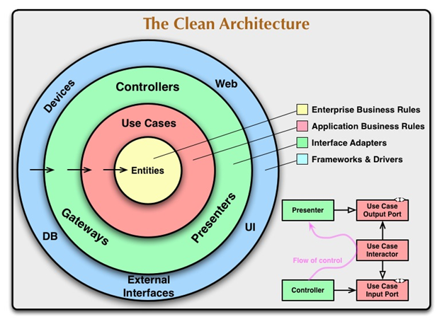

# Clean Architecture

Для наших целей, мы должны понимать, что Чистая Архитектура приложения, как и многие другие архитектуры,
делит ПО на уровни для достижения "разделения интересов".

Приложения следующие этой архитектуре должны работать только с нашими бизнес-правилами и должны быть:

 
1. Независимыми от фреймворка

2. Тестируемые

3. Независимые от UI

4. Независимые от БД

5. Независимые от любых внешних агентов

В Чистой Архитектуре ПО различные уровни должны быть концетрическими кругами. Чем ты дальше удаляешься
от центра, тем выше выше становится уровень ПО.

<blockquote>Внешние круги - это механизмы. Внутрение - политики</blockquote>

Зависимости исходного кода могут указывать только вовнутрь. Элементы внутри структуры должны оставаться
независимыми от любых внешних уровней. Ничто во внешнем круге не должно влиять на внутренний.

Следующее изображение иллюстрирует данную архитектуру:



**Сущности (Entities)**

Бизнес-объекты, которые можно использованы для различных приложений.

**Сценарии использования (Use Cases)**

Этот уровень имеет специфичные бизнес-правила приложения. Они содержат шаги необходимые для передачи
данных между сущностями и внешними уровнями приложения, что позволяет пользователям достигать своих
целей


**Адаптеры интерфейса (Interface Adapters)**

Этот уровень преобразует данные, которые могут прийти из интерфейса или хранилища данных, в структуру,
с которой могут работать сценарии использования и сущности

**Фреймворки и драйвера**

Он состоит из нашего презентационного уровня и, как правило, стороннего кода из сервисов и фреймворков

**Рубеж (Boundaries)**

Чтобы облегчить связь между уровнями, мы используем граничные интерфейсы для достижения инверсии зависимостей

#### Всегда пишите код, ориентируясь на пользователя

Я буду продолжать последний тренд написания примера, который реализует "Список дел". Даже когда проект совершенно
произвольный, я все же хочу определить личность. Я всегда начинаю свои проект таким образом. Я думаю, что это
хорошая привычка.

##### Gordon

Разработчик ПО в компании.


Он ответственен за разработку клинических отчетов компании. Он постоянно обрабатывает запросы клиентов на обновление,
необходимые для повышения эффективности отчетов. В последнее время он имел дело с большим количеством запросов. У него
были проблемы с отслеживанием прогресса и он потерял чувство ритма.

Его основная задача - завершить все запросы как можно быстрее.

Его главная цель - почувствовать степень завершенности в конце каждого рабочего дня.

### Потребности продукта 

Чтобы помочь Гордону с работой, мы напишем приложение Списка дел, чтобы Гордон мог отслеживать его задачи и прогресс.
С помощью пометки "дело сделано", мы надеемся он сможет почувствовать завершенность в конце рабочего дня. Наше приложение
будет также обеспечит механизм хранения и так мы сможем сохранять прогресс Городна.

В нашем приложение, элемент списка будет иметь следующий свойства:

* Дата создания
* Описание
* Флаг готовности
* Дата выполнения

Наше приложение так же будет поддерживать следующие сценарии использования (юзкейсы):

#### Экран Списка дел

Шаги:

1. Гордон хочет загрузить и посмотреть свой текущий список дел
2. Система обновляет статус приложения в "loading-todos-from-storage"
3. Система запрашивает у поставщика ToDo все элементы ToDo, которые пользователь когда-либо создавал
4. Система обновляет статус приложения в "applying-filters-to-todo-list"
5. Система применяет фильтры и правила сортировки, в последний раз указанные разработчиком
6. Система обновляет состояние приложения с помощью списка заданных задач
7. Система устанавливает приложению статус "готово"

#### Добавление нового элемента

Шаги:

1. Гордон предоставляет описание и инициирует процес создание новой задачи с ним
2. Система устанавливает приложению статус "adding-todo"
3. Система создает новую задачу ```
                               {
                                   "dateCreated": Date.now,
                                   "description": description,
                                   "done": false,
                                   "dueDate": null
                               }
                               ```

4. Система добавляет новую задачу в хранилище данных
5. Система обновляет состояние приложения
6. Система устанавливает приложению статус "готово"

#### Переключатель элемента списка

Шаги:

1. Гордон выбирает задачу, чтобы переключить
2. Система устанавливает приложению статус "toggling-todo"
3. Система переключает задачу флаг "done"
4. Система сохраняет изменения в хранилище данных
5. Система обновляет состояние приложения
6. Система устанавливает приложению статус "готово"

### Приложение

Следуя моим пояснениям концепции Чистой архитектуры, я создал следующую структуру приложения

